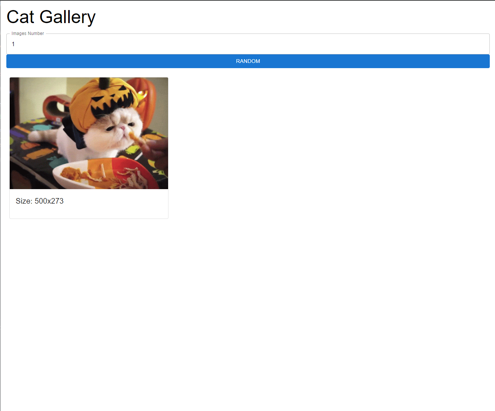
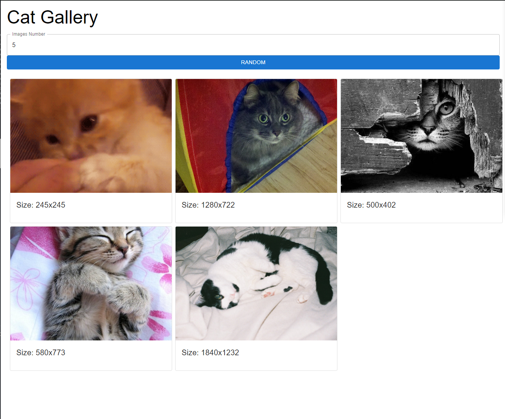
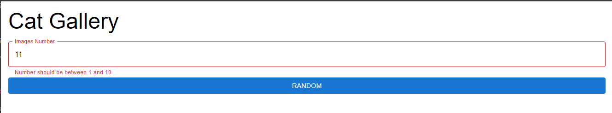

# Front End (React.js + Material UI)

## Software Requirement

-   Node.js v. 20.x.x (LTS)

ในแต่ละ Section สามารถใช้คำสั่ง `npm run test` เพื่อรัน Integration Test/Unit Test สำหรับตรวจสอบว่าได้ทำถูกต้องแล้วได้

**สามารถติดตั้ง Library อื่นๆเพิ่มเข้ามาได้**

ให้สร้าง Cat Gallery สำหรับแสดงผลรูปแมวทั้งหมดที่สามารถเรียกดูได้ผ่าน API ดังนี้

https://api.thecatapi.com/v1/images/search

API Key: `live_UMIEHUqwTGnUFY8TiJrv60nSuK36A42ddgNtFcb9YWb4lsQgXUJGvfJ4xcJfnlqA`

โดยมี Query Params สองตัว

-   limit: 0 - 10
-   api_key: API Key

เมื่อ User ใส่ตัวเลขบน Image Number Field และทำการ กดปุ่ม Random ระบบต้องทำการ Random รูปตามจำนวนที่ User กรอก และหาก User กรอกเลขที่ไม่ใช่ 1-10 ให้ขึ้นเตือนดังรูปที่ 3

> Note: tag data-testid ห้ามถูกลบออกเพราะใช้สำหรับในการทำ Unit Test สำหรับการทดสอบครั้งนี้

ตัวอย่าง

รูปที่ 1

รูปที่ 2

รูปที่ 3

